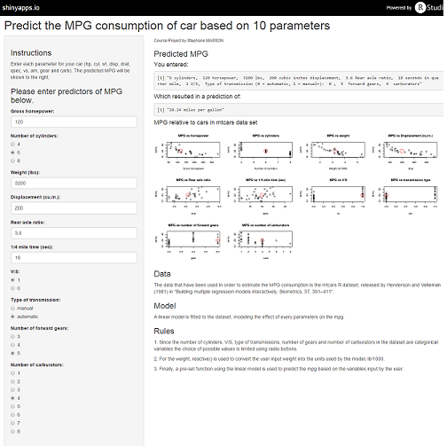

## Introduction
.fragment <p style="line-height: 1em"><small>
Nowadays we are facing an unprecedented environmental crisis. The ever growing consumption of fossil fuels puts earth and humanity at risk. In fact, most scientificts are concerned that if we keep on our current way of life will emit too much greenhouse gazes (CO2, NOx, CH4 etc.), going beyond a 2 Celsius degree temperature raise changing earth environment for ever. </small></p>

.fragment <p style="line-height: 1em"><small>[Car emissions](http://www.gnesg.com/index.php?option=com_content&view=article&id=48:que-pese-lautomobile-dans-les-bilans-energetique-et-climatique-mondiaux-&catid=27&Itemid=53) are a big part of those emission and fossil fuel consumption. <strong>Studies have shown that they account for 15% of the overall pollution (4th cause of air pollution) and 34% of oil consumption (1st cause of oil consumption)</strong>. As a consequence, we have high insentive to be aware of the potential environmental damage made by our main way of transportation.</small></p>

.fragment <p style="line-height: 1em"><small>This application aims to provide some information to help people choose the most efficient cars regarding fuel consumption (and by extension pollution emission) based on 10 factors: 
<ul style="list-style-type:circle">
  <li>Number of cylinders, </li>
  <li>Displacement (cu.in), </li>
  <li>Gross horsepower, </li>
  <li>Rear axle ration,</li>
  <li> Weight, </li> 
  <li>1/4 mile time (sec), </li>
  <li>V/S, </li>
  <li>Type of transmission, </li>
  <li>Number of forward gear, </li>
  <li>Number of carburators</li>
  </small></p>

--- .class #id 


## Data and how it works

.fragment <p style="line-height: 1em"><small>The data that have been used in order to estimate the MPG consumption is the mtcars R dataset, released by Henderson and Velleman (1981) in "Building multiple regression models interactively. Biometrics, 37, 391-411".

<ol>
<li class="fragment roll-in">
A linear model is fitted to the dataset, modeling the effect of every parameters on the mpg. </p>

<li class="fragment roll-in">
Since the number of cylinders, V/S, type of transmissions, number of gears and number of carburators in the dataset are categorical variables the choice of possible values is limited using radio buttons. </p>

<li class="fragment roll-in">
For the weight, reactive() is used to convert the user input weight into the units used by the model, lb/1000.  </p>

<li class="fragment roll-in">
Finally, a pre-set function using the linear model is used to predict the mpg based on the variables input by the user.</p>
</ol>
</small></p>

--- .class #id 

## Manual transmission is better thant automatic

.fragment <p style="line-height: 1em"><small>By the look of the plots, it seems that in average (red point) manual transmission cars have a better performance regarding fuel consumption (in average mpg is smaller for automatic cars than for manual cars). This was confirmed by a t-test in order to statistically reject this hypothesis.</small></p>

```{r, echo = FALSE}
library(datasets);data(mtcars);library(stats);library(ggplot2); library(Hmisc);

g = ggplot(data = mtcars, aes(y = mpg, x = factor(am), fill = factor(am)))
g = g + geom_violin(colour = "black", size = 2)
g = g + xlab("Automatic/Manual transmission") + ylab ("Miles per gallon") 
g = g + stat_summary(fun.data=mean_sdl, mult=0, 
                 geom="pointrange", color="red")
g
```

--- .class #id 

## Effect of weight and HP on MPG


```{r, echo = FALSE}
fit <- lm(mpg~factor(am), data = mtcars)
fit1 <- lm(mpg~factor(am)+wt, data = mtcars)
fit2 <- lm(mpg~factor(am)+wt+hp, data = mtcars)
fit3 <- lm(mpg~factor(am)+wt+hp+cyl+gear+disp+drat+qsec+vs+carb, data = mtcars)
anova(fit, fit1, fit2, fit3)
```

.fragment <p style="line-height: 1em"><small>
The anova test shows that wt and hp are the two other most significant variables impacting the MPG.
</small></p>
```{r, echo = FALSE, result = "hide"}
rsqr <- summary(fit2)$r.squared
```

.fragment <p style="line-height: 1em"><small>R² for a model with the type of transmission, weigth and gross horsepower as predictors is `r rsqr`, which mean that 84% variance in MPG is explained by this three parameters.</small></p>

.fragment <p style="line-height: 1em"><small> <span style="color:#33FF99; font-weight:bold">However for our application we have choose to use all the available parameters in order to enable people to make the most enlightned choice of car possible.</span></small></p>

--- .class #id 

## The application


[Access the app online](https://stmasson.shinyapps.io/Data_Product)

--- .class #id 

